# AI Comprehensive Abstract Screening (ACAS)
## Introduction
When performing a Systematic Literature Review (SLR), the Abstract Screening Process (ASP) can be a very consuming and laborious task, especially when researchers retrieve a significant number of citations after running queries in the selected databases. This can translate into many hours of work.\
 
This repository implements the Machine Learning-based methodology described in Serrato-Fonseca et al. (2024) and introduces the AI-based Comprehensive Abstract Screening (ACAS) tool that permits researchers to create their own ASP. This document is a detailed guideline to implementing said tool in any given SLR process.\
 
The tool works by viewing the choice of including a reference into the literature or not as a supervised machine learning (binary classification) problem. It allows the decision maker to leverage a small number of manually classified abstracts.

## Beforehand
The first step to use this tool is to create an API key via the [Developer Portal of Elsevier](https://dev.elsevier.com/). Usually, this is done by logging in your scholar account (institutional account) and requesting an API key. <u>Be sure that the API that you received can support the COMPLETE view, otherwise the app will not work as expected. For more information on the view and the query requests, check out [this website](https://dev.elsevier.com/documentation/ScopusSearchAPI.wadl)</u>. After the key is obtained, you can download the executable file in the releases tab of the github repo.

## How to use
\**Images and videos may not be up to date*\*\
The usage of this tool is fairly straightfoward and comes back to three steps. The first one is the appending of papers to the dataset, the second is the operating curve for the corroboration of the AI and the third one is letting the AI predict the probability of acceptance.

### Parameters
When starting the executable, you will arrive at the first step, this is where you will do the querying from the Scopus database.\
 
The first operation you must do is setting up the environment variables. This is easily done with the parameters window. There, you will find five fields.\
 
The first one is the number of papers you want to query from the database. If you are unsure about this field, please consult the maximum querying you can do with the given API key (the value should always be greater than 0).\
 
On the subject of the API key, the second field will ask you for your API key. **As stated in the _How to use_ section, the API key must support the COMPLETE view**.\
 
If multiple users are on the same computer, the Scopus database will ask for a user token. More information about this is given on [this](https://dev.elsevier.com/documentation/ScopusSearchAPI.wadl) webpage.\
 
Finally, the two last fields are used to identify the cutoff used when the papers are assigned a probability of acceptance (the values should be between (0, 1) excluding). More information can be found in the [original paper](https://www.gerad.ca/en/papers/G-2024-53.pdf).\
 
If every field is entered correctly, you should be able to proceed with the querying, otherwise, an exception will be thrown here or later.
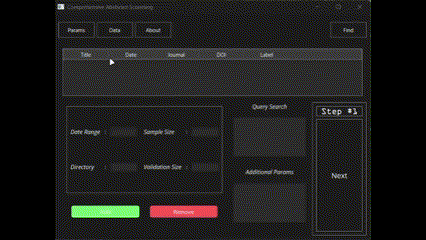

### First Step
The first step is probably the most important. This is where you will find the papers related to your field and which ones will be analyzed by the AI. You have two main buttons, the `add` and the `remove`. The `add` button, on the first hand, adds the querying to the database. The `remove` button, on the other hand, will remove the papers that are queried if they were added to the dataset.\
 
When querying, you must choose a date range that seems interesting for your research. If no date is provided, all papers related will be queried. Afterwards, a sample size and a validation size must be provided, where the sample size is for training the AI and the validation size is for corroborating the predictions.\
 
The querying itself will be based on the query search information (first box, on top) given by [this website](https://dev.elsevier.com/sc_search_tips.html) with additional parameters (second box, on bottom) in a standard formatting for an HTTP `GET` method, that is: param1={stuff}&param2={stuff}.... The extra parameters can be obtained through the [API documentation](https://dev.elsevier.com/documentation/ScopusSearchAPI.wadl).\
 
This can be summed up with the following diagram :
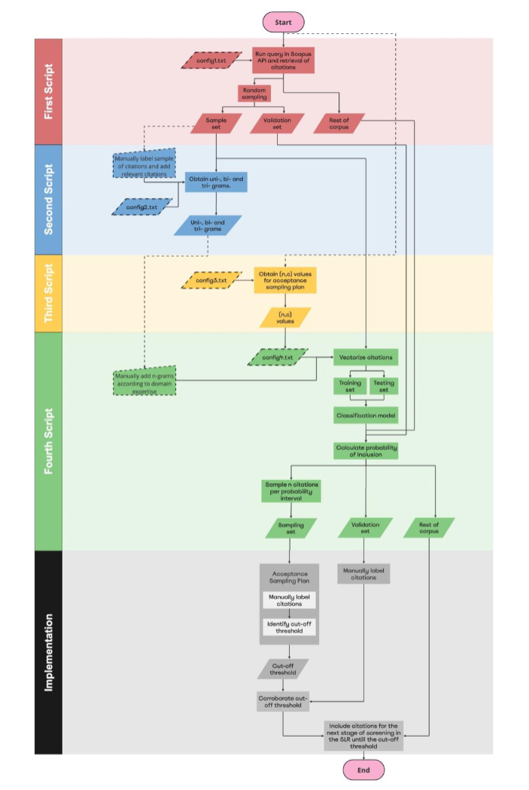
Finally, if no directory is provided, the querying will automatically go in the <u>~/.acas/query</u> folder.
 
 
Here lies an example of what it should look like :
 
 
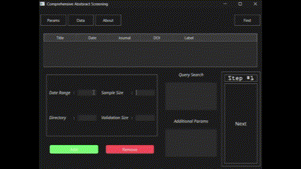

### Data Window
If papers are already found and stored, it is possible, with the data window, to add, remove and move the papers from one dataset to another. That makes it possible to skip undersampling and oversampling in the last step of the procedure.
 
 
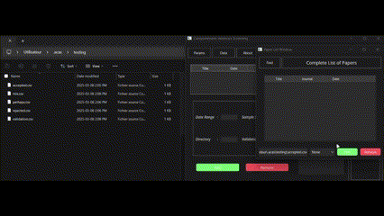
Also, the data window, as the main window on the first step, implement the functionality of finding papers based on some criterias that were provided. As an example, suppose that you want to find all the papers that are from the <i>IEEE journal</i>, with the find window, you can add a search criteria to find all papers (labeled, unlabeled, accepted or rejected) that are from that specific journal.
 
 
<b>A common error is to forget to change the date range, which, automatically gets added to the search criterias. Do not forget to change the date range.</b>
 
 

If you want to see all the papers after some specific search criteria, just press the <code>Clear All</code> button, which will reset the window.

If you want to remove all papers that respect a specific criteria (such as all papers from the <i>IEEE journal</i>), just press the <code>Clear from search</code> button. I must advise that this is not recommended, since you may exclude papers that are valid to your specific needs.

 
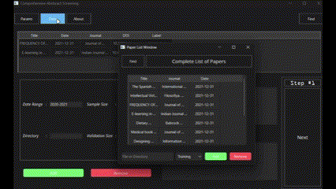

### Labeling
The labeling process is quite easy. The only thing you must do is to click on the paper you want to accept/reject and a window will pop with all the necessary information for you to make your decision. If you proceed with papers that are not labeled, they will automatically be included. This is done to minimise the chances of false negatives, which are detrimental to the ASL process. For more information, please go see the [original paper](https://www.gerad.ca/en/papers/G-2024-53.pdf).
 
 

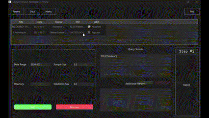

*Here, I didn't select the COMPLETE view but the STANDARD view, hence the lack of description*.

### Operating Characteristic Curve (OCC)
The operating characteristic curve is based on a [hypergeometric distribution](https://en.wikipedia.org/wiki/Hypergeometric_distribution). It gives out the number of positives that you need in a batch to accept or reject some paper interval. This is done to minimize, once again, the number of false negatives. More information is given by the [original paper](https://www.gerad.ca/en/papers/G-2024-53.pdf).
 
 
Comparing this to the querying process, this is way easier to do. You just plug the numbers in and you let the graph plot its plot. A window will then appear with the relevant information for the last step.
 

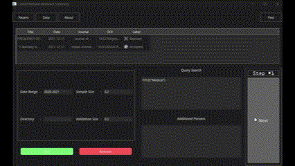

### AI Window
The AI window is relatively complex, since you must manually enter the AI parameters, and that requires some knowledge about how AI are designed. Since this project is not designed to teach you about AI, I would recommend going on your own to find the appropriate knowledge. Some good place to start are the websites [Geeks for Geeks](https://www.geeksforgeeks.org/) and [Scikit learn](https://scikit-learn.org/stable/index.html). For the following section, I will assume you know the basics of AI or you have read the original paper.\
 
Before going in the details of the AI and how the AI step works, you must select, from a `QDialog` box the minimal number of words found for it to be considered a point value in the training model.\
 
Indeed, the model is trained based on the vectorization of words (or group of words up to three) in a process called stemming. A paper is then evaluated based on which stem is found (or groups of words called n-grams, where n is the number of words) and a vector of the number of each stem found is returned.\
 
When the number entered is confirmed (or if no number is entered, then 3 is selected automatically), a window showing the list of the n-grams will appear.
 
 
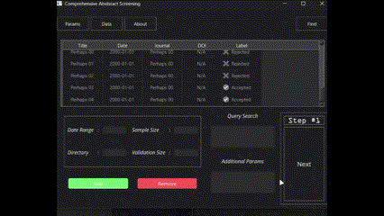

Then, you are presented with a few edit boxes. The first one designates the percentage (in decimal form) of the papers in the validation dataset that will become a testing dataset. The default value for this is given by 0.2, but can be changed according to your needs.\
 
Since there are a lot of research papers out there, most of them queried will be of no interest. That means the positive ratio will tend towards zero. This is a problem, since too little information about positive results will skew the AI towards rejecting more and accepting less. Since we want to minimize the number of false negatives, we need a ratio that is "acceptable". [Serrato-Fonseca et al. (2024)](https://www.gerad.ca/en/papers/G-2024-53.pdf) suggested a ratio of 0.3, which is the default value for this app.\
 
Given that we need lots of positively rated papers, that will make the AI tend to overfit the given dataset. One solution to this overfitting problem is to analyze how the model evaluates a small part of its dataset whilst ignoring another. This is called [cross-validation](https://www.geeksforgeeks.org/cross-validation-machine-learning/). Here, we implement the cross-validation itself with a number of splits that the AI will analyze. Note that the more splits you have, the longer the cross-validation will take (it is computationally expensive). You cannot have less than two splits or more than the number of papers analyzed. In other words, please be reasonable with the number of splits, otherwise, as a hangover may also tell you, you will regret it.
 
 
The training itself, since it must be replicable, will be based on the training and testing datasets that are separated according to the seed that was given to the dataset. That implies that, in theory, the same seed must provide the same results.
 
 
Finally, the last section is about the model and the sampling method (in the case where the positive ratio is not up to the value wanted). There are many models out there with multiple advantages and disadvantages, but, as stipulated in [Serrato-Fonseca et al. (2024)](https://www.gerad.ca/en/papers/G-2024-53.pdf), only the [Logistical Regression](https://en.wikipedia.org/wiki/Logistic_regression) and [Decision Tree](https://en.wikipedia.org/wiki/Decision_tree) based models are implemented.
 
 
Once everything has been selected, press the next button, where three windows will appear given you the statistics of the model (accuracy, recall, precision and f1) in different databases. If you deem this acceptable, you may choose the `Ok` button. Otherwise, choose the `Cancel` button and try a different seed.
 
 
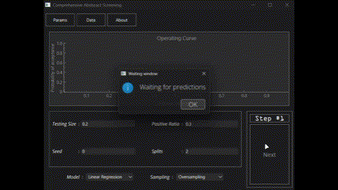

When the AI model is confirmed, it will assign the probabilities of each paper being accepted and will prompt you with a window for the cutoff. The cutoff serves, as its name imply, as a minimal probability of acceptance threshold for the papers.
 
 
This is where the hard work pays off.
  
If everything went according to plan, you will see a window (starting at the threshold specified in the parameters window) that includes all the papers from the threshold to the threshold plus the step. If, you find $c$ positive paper out of a sample of $n$, you must accept the batch, otherwise, continue until you meet this criteria ($n$ and $c$ are given by the previous step of the _OCC_).
 
 
You will need to do this with part of the sampling dataset and corroborate this threshold with the validation dataset. If the two threshold do not correspond, the minimum of the two will be taken as the valid one.
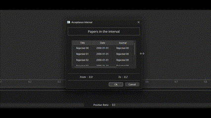

At the end, you will see a message saying that the values are printed at a specific location with their relative probability of acceptance.
 
 
The only thing left to do is to go read, so good reading &#128513;
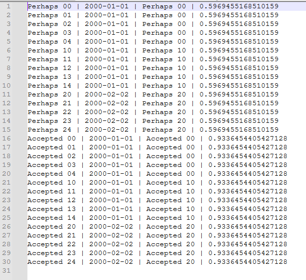

## About the code
The ACAS project is based on the Python programming language implementing the [PyQt library](https://doc.qt.io/qtforpython-6/) based around the popular [Qt](https://doc.qt.io/qt-6/get-and-install-qt.html) framework. It also uses many Data-Science driven modules such as the [SciKit Learn](https://scikit-learn.org/stable/index.html) for the implementation of the AI and [NumPy](https://numpy.org/) for data manipulation. For optimization purposes, this application is concurrent, yet not parallel because of Python scoping rules.\
 
The main app starts in the [__init__](./__init__.py) file where the main class (`MainWindow`) synchronizes the multiple windows to be on the same datasets and connects the dozens of signals present. Please note that the `MainWindow` is not supposed to keep the datasets, since that is the job of the `Data` class, which also manages the diverse windows showing parts (but not all) of the paper list. For more information on how the papers are kept linked together and how the data is managed, it is strongly suggested to read the documentation in the code itself.\
 
As you can see, the project is divided into multiple files, but only three actually matter. The first one is the [__init__](./__init__.py) file which is the entry point of the app; as explained in the previous paragraph. The second one is the [entities](./ui/display/entities.py) file, which is just a list of concrete implementations of PyQt widgets. It also holds the logic for showing the data in the `QTableView`s and many standard `QWidget`s. Finally, there is the [windows](./ui/windows.py) file with the rest of the UI, but, this time, unlike the [entities](./ui/display/entities.py) file, this is where the `.ui` files, from the directory [./ui/xml/](./ui/xml/), are actually created. This includes classes such as the `Data` class and the `First` class where the main logic (such as querying from Scopus) is found.\
 
Since this application works in steps, the logic is based around a manually incremented unidirectional iterator. This makes it possible to change the bottom window (or the options window) each new step and makes it easier to implement cross-step logic with *mounting* and *dismounting* operations. The main logic of the *mounting* is done by the `MainWindow` class, where each step is documented in the code. Adding a new step is as easy as creating two new functions (one in case of an error and a regular step) and an options window.
 
This repo was previously based on scripts that the user must've executed. It was based on the Structured Programming philosophy. Now, the main methods are found in classes (since PyQt and pretty much every UI framework works on OOP or something similar), mainly `First`, `OperatingCurve` and `MainWindow` respectively.\
 
The script is condensed by `pyinstaller` to an executable. If you want to work on this, you must fork this repo for then to install the following libraries:
<ul>
<li><code>SciKit Learn</code></li>
<li><code>NumPy</code></li>
<li><code>PySide6</code></li>
<li><code>pyqtGraph</code></li>
<li><code>nltk</code></li>
<li><code>Pandas</code></li>
<li><code>urllib</code></li>
<li><code>aiohttp</code></li>
<li><code>QDarkStyle</code></li>
<li><code>SciPy</code></li>
</ul>
 
And have a Python version greater than 3.12 for typing support and the modern <code>aiohttp</code>, <code>threading</code>, <code>re</code>, etc. environments.
 
 
Information about the methods are provided directly in the classes, but some methods (particularly the <code>predictions</code> method in the <code>MainWindow</code> class) can be difficult to wrap your head around. Actually, if you want to modify the code itself, you must firstly understand that everything is linked together and almost everything is passed by reference and not value. This is done for optimization purposes, but can lead to <b>very</b>, <b>very</b> hard to find bugs (such as the <code>predictions</code> method).
 
 

The only thing left to say is: Good luck to you!